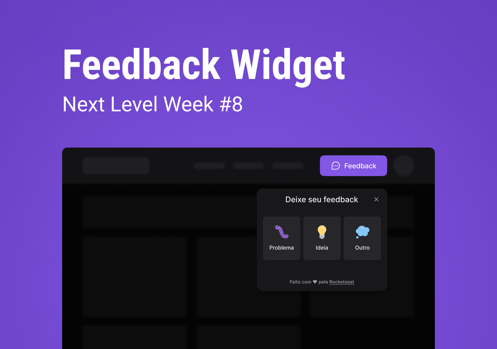

# Fidget
> Projeto desenvolvido durante a Next Level Week Return na triha Impulse

## Ideia
O projeto Fidget tem como propósito facilitar a implementação de um meio de comunicação entre o usuário final do serviço ao time de suporte por meio de mensagens de feedbacks.

O Fidget facilita isso permitindo que usuário envie um ou mais feedbacks categorizando como `Bug`, `Ideia` ou `Outro` e escreva um comentário sobre o que está acontecendo com um anexo opcional sobre o que está aconcendo na tela no momento do feedback.

## Layout
[Layout no Figma do projeto](https://www.figma.com/community/file/1102912516166573468)

## Tecnologias
Para manter o projeto simples e útil o projeto foi construindo usando tecnologias de fácil implementação e com resultados grandes
### Front-end
[Link do projeto](https://github.com/Guigalaverna/fidget-web)
- Vite.js
- React
- TypeScript
- Axios
- TailwindCSS
- html2canvas
- HeadlessUI

### Back-end
[Link do projeto](https://github.com/Guigalaverna/fidget-server)
- Node.js
- TypeScript
- Prisma
- Express
- Jest

## A milha extra
Como desafio proposto no último vídeo da semana, a criação de tema escuro e claro foi implementada com sucesso permitindo que o usuário escolha entre os dois temas apenas trocando o tema padrão do navegador/sistema.

## Agradecimentos
Um grande obrigado para a Rocketseat que se dedicou a criar uma semana incrível com muito conhecimento aplicado 💜.
